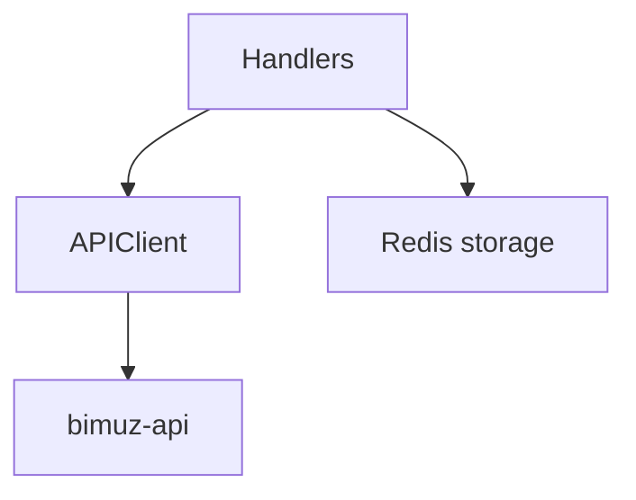

# BIMUZ Telegram Bot (aiogram)

Telegram bot for BIMUZ employees. It is a **convenience interface** over `bimuz-api` and follows the same RBAC strategy as the dashboard, but with one important security decision:

> **Reports (Hisobotlar) are disabled in the bot** because they contain sensitive financial information.

## Table of contents

- [Overview](#overview)
- [Security & RBAC strategy](#security--rbac-strategy)
- [Main menu](#main-menu)
- [Feature modules](#feature-modules)
- [Installation](#installation)
- [Configuration](#configuration)
- [Project structure](#project-structure)

```mermaid
flowchart LR
  U[Telegram user] --> BOT[bimuz-bot (aiogram)]
  BOT -->|JWT| API[bimuz-api]
  BOT --> RS[(Redis sessions)]
  API --> DB[(PostgreSQL)]
```

---

## Security & RBAC strategy

### Centralized permissions
All UI gating (what buttons appear) and handler checks use:
- `permissions.py`
- `keyboards.py` hides actions if permission is not granted (e.g. if role cannot create a student, **“➕ Yangi talaba”** will not appear).

### Role hierarchy
**Dasturchi > Direktor > Administrator > Buxgalter > (Mentor / Sotuv agenti / Assistent)**

### Reports are disabled
- No “📄 Hisobotlar” in the main menu
- Even if user sends the text manually, bot responds with “not available via bot”
- `reports.router` is not registered in `bot.py`

## Main menu

Current menu contains:
- 👤 Profil
- 👥 Talabalar
- 📚 Guruhlar
- 💳 To'lovlar (student invoices)
- 👨‍💼 Xodimlar (read for all; CRUD role-based)
- 📋 Davomatlar
- 📁 Hujjatlar
- ❌ Chiqish

## Feature modules

### Students (Talabalar)
- Read list + detail for authenticated users
- Create/Edit/Delete buttons appear only if role has permission
- Booking to group is also permission gated

### Groups (Guruhlar)
- Read list + detail
- Create/Edit/Delete are permission gated and hidden when not allowed

### Payments (To'lovlar)
- Student invoices only (search, filter, details)
- Payment links can be generated if invoice is not paid/cancelled

### Attendances (Davomatlar)
- Read attendances list
- List shows group name + date + participants count
- Also shows **mentor name** for each attendance (resolved from group when needed)

### Employees (Xodimlar)
- Employees list is readable for all authenticated roles
- Edit/Delete actions are hidden unless allowed by role hierarchy rules

### 📊 Additional Features
- ✅ **Search functionality** in payments
- ✅ **Filter functionality** by status
- ✅ **Pagination** for all lists
- ✅ **HTML formatting** for better readability
- ✅ **Error handling** with user-friendly messages
- ✅ **Input validation** for phone and passport

---

## Architecture (high level)



---

## Installation

### Prerequisites

- Python 3.13+
- Redis server
- Access to BIMUZ Backend API

### Step 1: Clone Repository

```bash
cd /path/to/bimuz
# Bot is located in bimuz-bot/ directory
```

### Step 2: Create Virtual Environment

```bash
cd bimuz-bot
python3 -m venv venv
source venv/bin/activate  # On Windows: venv\Scripts\activate
```

### Step 3: Install Dependencies

```bash
pip install -r requirements.txt
```

### Step 4: Configure Environment

```bash
cp .env.example .env
```

Edit `.env` file:

```env
# Telegram Bot Token (from @BotFather)
BOT_TOKEN=your_bot_token_here

# Bot Mode: 'dev' (polling) or 'prod' (webhook)
BOT_MODE=dev

# Webhook Configuration (for prod mode only)
WEBHOOK_HOST=https://bot.bimuz.uz
WEBHOOK_PATH=/webhook
WEBHOOK_SECRET=your_secret_token_here  # Optional: random string for security
WEBHOOK_PORT=8443

# Backend API URL
API_BASE_URL=http://localhost:8000

# Redis Connection URL
REDIS_URL=redis://localhost:6379/0
```

### Step 5: Start Redis

**Option 1: Using Docker**
```bash
docker run -d -p 6379:6379 redis:alpine
```

**Option 2: Using System Service**
```bash
sudo systemctl start redis
```

### Step 6: Run the Bot

**Development Mode (Polling):**
```bash
# Set BOT_MODE=dev in .env (default)
python bot.py
```

**Production Mode (Webhook):**
```bash
# Set BOT_MODE=prod in .env
# Configure WEBHOOK_HOST, WEBHOOK_PATH, WEBHOOK_PORT
python bot.py
```

**Important Notes for Production Mode:**
- ✅ Bot must be accessible via HTTPS (required by Telegram)
- ✅ Server IP must be whitelisted in Telegram (if using firewall)
- ✅ Webhook will be automatically set on bot startup
- ✅ Webhook server runs on port specified in `WEBHOOK_PORT` (default: 8443)
- ✅ Use reverse proxy (nginx/traefik) to forward HTTPS to bot port
- ✅ `WEBHOOK_SECRET` is optional but recommended for security

---

## Configuration

### Environment Variables

| Variable | Description | Required | Default |
|----------|-------------|----------|---------|
| `BOT_TOKEN` | Telegram bot token from @BotFather | ✅ Yes | - |
| `BOT_MODE` | Bot mode: `dev` (polling) or `prod` (webhook) | ❌ No | `dev` |
| `WEBHOOK_HOST` | Webhook host URL (for prod mode) | ❌ No* | `https://bot.bimuz.uz` |
| `WEBHOOK_PATH` | Webhook path (for prod mode) | ❌ No* | `/webhook` |
| `WEBHOOK_SECRET` | Webhook secret token (optional, for prod mode) | ❌ No | - |
| `WEBHOOK_PORT` | Webhook server port (for prod mode) | ❌ No* | `8443` |
| `API_BASE_URL` | Backend API base URL | ✅ Yes | `http://localhost:8000` |
| `REDIS_URL` | Redis connection URL | ✅ Yes | `redis://localhost:6379/0` |

\* Required when `BOT_MODE=prod`

### Role-based access (summary)

Bot uses `permissions.py` as a single source for:
- Create/Update/Delete Students
- Create/Update/Delete Groups
- Employee CRUD restrictions by hierarchy

> Reports are intentionally excluded from bot access.

**Roles:**
- **Dev** = Dasturchi (Developer)
- **Dir** = Direktor (Director)
- **Adm** = Administrator
- **Men** = Mentor
- **Sal** = Sotuv agenti (Sales Agent)
- **Ass** = Assistent (Assistant)

---

## Usage

### Starting the Bot

1. **Send `/start` command** to the bot
2. **Enter your email** when prompted
3. **Enter your password** when prompted
4. **Access the main menu** with role-based buttons

### UI behavior note
If a role cannot perform an action, bot will:
- hide the action button in inline keyboards (create/edit/delete)
- and still validate permission inside the handler (backend safe)

### Example Workflows

#### Creating a Student
```
User → 👥 Talabalar → ➕ Yangi talaba
     → Enter name → Enter phone → Enter passport
     → Enter birth date → Select source → Enter address
     → ✅ Student created!
```

#### Creating a Payment Link
```
User → 💳 To'lovlar → Select invoice
     → 💳 To'lov linkini yaratish
     → ✅ Payment link created!
```

#### Searching Payments
```
User → 💳 To'lovlar → 🔍 Qidirish
     → Enter search query (name, phone, group, ID)
     → View filtered results
```

---

## Project structure

```
bimuz-bot/
│
├── 📄 bot.py                 # Main bot entry point
├── ⚙️  config.py              # Configuration settings
├── 🔌 api_client.py           # Backend API client
├── 💾 storage.py              # Redis session storage
├── ⌨️  keyboards.py            # Keyboard layouts
├── 🛠️  utils.py                # Utility functions
│
├── 📂 handlers/               # Bot handlers
│   ├── 🔐 auth.py             # Authentication handlers
│   ├── 👥 students.py         # Student management
│   ├── 📚 groups.py           # Group management
│   ├── 💳 payments.py         # Payment handlers
│   ├── 👨‍💼 employees.py      # Employee management
│   ├── 📋 attendance.py       # Attendance handlers
│   ├── 📄 reports.py          # Reports handler file (disabled; router not registered)
│   ├── 📁 documents.py        # Documents handlers
│   └── 🔄 common.py           # Common handlers
│
├── 📋 requirements.txt        # Python dependencies
├── 🔧 .env.example            # Environment variables example
├── 🐳 Dockerfile              # Docker configuration
├── 🐳 docker-compose.yml      # Docker Compose config
└── 📖 README.md               # This file
```

---

## Technology stack

```
┌─────────────────────────────────────────────────────────┐
│                    Technology Stack                     │
├─────────────────────────────────────────────────────────┤
│                                                         │
│  🤖 Bot Framework                                       │
│     └─ aiogram 3.24.0                                   │
│                                                         │
│  🌐 HTTP Client                                         │
│     └─ aiohttp 3.13.3                                   │
│                                                         │
│  💾 Session Storage                                     │
│     └─ redis 5.0.1                                      │
│     └─ hiredis 2.3.2                                    │
│                                                         │
│  ⚙️  Configuration                                      │
│     └─ python-dotenv 1.0.0                              │
│                                                         │
│  📊 Data Validation                                     │
│     └─ pydantic 2.12.5                                  │
│                                                         │
└─────────────────────────────────────────────────────────┘
```

### Key Dependencies

| Package | Version | Purpose |
|---------|---------|---------|
| `aiogram` | 3.24.0 | Telegram Bot API framework |
| `aiohttp` | 3.13.3 | Async HTTP client for API requests |
| `redis` | 5.0.1 | Redis client for session storage |
| `hiredis` | 2.3.2 | Fast Redis protocol parser |
| `python-dotenv` | 1.0.0 | Environment variable management |
| `pydantic` | 2.12.5 | Data validation |

---

## Data flow

```
┌─────────────┐
│   User      │
│  (Telegram) │
└──────┬──────┘
       │
       │ 1. Send command/message
       ▼
┌─────────────┐
│   Handler   │
│  (aiogram)  │
└──────┬──────┘
       │
       │ 2. Check session (Redis)
       ▼
┌─────────────┐
│   Storage   │
│   (Redis)   │
└──────┬──────┘
       │
       │ 3. Get/Set session data
       ▼
┌─────────────┐
│ API Client  │
│  (aiohttp)  │
└──────┬──────┘
       │
       │ 4. Make API request
       ▼
┌─────────────┐
│   Backend   │
│     API     │
│  (Django)   │
└──────┬──────┘
       │
       │ 5. Return response
       ▼
┌─────────────┐
│   Handler   │
│  (Format &  │
│   Display)  │
└──────┬──────┘
       │
       │ 6. Send formatted message
       ▼
┌─────────────┐
│   User      │
│  (Telegram) │
└─────────────┘
```

---

## Notes

### Session Management
- **Redis-based storage** ensures sessions persist across bot restarts
- **Automatic token refresh** when access token expires
- **7-day session lifetime** (matches refresh token expiry)

### Error Handling
- **User-friendly error messages** in Uzbek language
- **Automatic retry** on network errors
- **Graceful degradation** when API is unavailable

### Input Validation
- **Phone format**: `+998901234567` (13 chars, starts with +, no spaces/dashes)
- **Passport format**: `AA0000000` (9 chars, 2 letters + 7 digits, no spaces)

### Payment Progress Tracking
- **Partial payment support** for installment-based payments
- **Real-time calculation** of paid vs. total amount
- **Visual progress indicators**

---

## 📝 Notes

### Development Mode (Polling)
- ⚠️ **Redis is required** for session persistence
- ⚠️ **Backend API must be running** and accessible
- ⚠️ **Bot token** must be valid and active
- ✅ **Simple setup** - no additional configuration needed
- ✅ **Sessions survive** bot restarts thanks to Redis
- ✅ **Automatic token refresh** handles expired tokens
- ✅ **HTML formatting** prevents parsing errors from special characters

### Production Mode (Webhook)
- ⚠️ **HTTPS is required** - Telegram only accepts HTTPS webhooks
- ⚠️ **SSL certificate** must be valid and trusted
- ⚠️ **Reverse proxy** (nginx/traefik) recommended for HTTPS termination
- ⚠️ **Firewall configuration** - allow Telegram IPs or whitelist your server
- ✅ **Faster response** - real-time updates instead of polling
- ✅ **Lower server load** - only processes actual updates
- ✅ **Automatic webhook setup** on bot startup
- ✅ **Webhook secret** adds extra security layer

---

Last updated: January 2026
